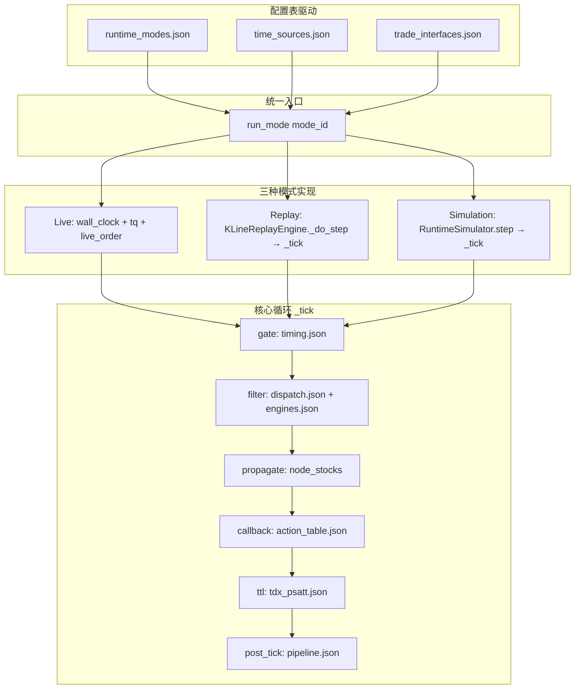

## 产品概述

股票池是一个实时、并发、异步、数据驱动、时间驱动的持续循环PK股票分析、看盘、决策、交易、监控、记录的完整平台。不是选股器，而是一个有向图上的逐边条件过滤持续执行系统。

## 核心功能

### 1. 功能-表映射精炼

- 审计engine.py/builtins/app.py中每一项功能，将每功能精确映射到对三类表（配置表/运行时表/持久表）的读/写操作
- 识别仍硬编码在Python中的非核心业务逻辑，剥离到JSON配置表
- 统一runtime_simulator.py与engine.py的run_mode("simulation")入口，消除重复实现

### 2. 三种运行模式统一与验证

- 实盘模式(live): wall_clock时间源 + TQ/akshare实时数据 + live_order交易接口 + 允许副作用
- 回放模式(replay): sequence时间源(K线时间轴) + 历史K线缓存 + noop交易 + 不允许副作用
- 仿真模式(simulation): virtual时间源 + mock随机数据 + paper_trade模拟成交 + 不允许副作用
- 三种模式统一通过run_mode(mode_id)入口进入，差异仅由runtime_modes.json/time_sources.json/trade_interfaces.json三张配置表驱动

### 3. 端到端全面功能验证

- 通过API手动创建完整股票池(备选池→转移条件→状态池→转移条件→状态池)
- 验证所有节点/边属性在前后端正确传递和渲染
- 验证数据获取（TQ/akshare/mock）在三种模式下正确工作
- 验证核心循环(gate→filter→propagate→callback→ttl→post_tick)每一步的正确输出
- 验证持仓跟踪/交易信号/事件流/告警的生成与传递
- 验证前端界面显示真实数据而非占位符

### 4. 已知问题修复

- dzh_api.py全局单例非线程安全
- import-and-save端点未写入storage
- tdx_evaluators.py的nset3/4/5 mock降级未走fallback_chain.json
- paper_trade交易接口仅有配置定义无实际实现
- app.py中_STOCK_NAMES硬编码全局作用域

## 技术栈

- 后端：Python 3, FastAPI, Pydantic v2, asyncio, SQLite
- 前端：原生 JavaScript + SVG（现有web/目录）
- 配置存储：JSON文件（config/目录，60+张表）
- 数据源：TqAdapter门面 → DataSourceManager → tq/akshare/mock降级链

## 实现方案

### 核心策略：表驱动精炼 + 模式统一 + 端到端验证

当前项目已建立表驱动架构基础（54张配置表、9张持久表、20+运行时表），但存在三类问题：

1. **残留硬编码**：部分逻辑仍散落在Python代码中而非查表执行
2. **模式未统一**：runtime_simulator.py独立实现了一套模拟逻辑，未委托给engine.py的run_mode
3. **验证不充分**：仅做过E2E XML解析验证，未验证运行时数据流

#### 阶段一：功能-表映射审查与精炼

逐函数审查engine.py(470行)、builtins.py(253行)、builtins_filters.py(535行)、builtins_actions.py(311行)、builtins_post_tick.py(113行)，对每个函数标注：

- 读哪张配置表 → 读哪张运行时表 → 写哪张运行时表 → 写哪张持久表
- 识别硬编码分支(if type==xxx / if nset==x)应进配置表而未进
- 识别非核心业务代码(格式转换、编码解码、UI渲染参数组装)应剥离到配置表

重点精炼项：

- `_resolve_flow_attrs()`中DynamicFlowModel.from_int()调用：attr位标志解码应查field_definitions.json
- `_emit_transfer_events()`中`_role_handlers`硬编码字典：应查pool_roles.json的role_resolution.rules
- builtins.py中`_gen_sector_stocks()`硬编码随机生成逻辑：应查mock_data.json
- tdx_evaluators.py中nset3/4/5各自的mock分支：统一走fallback_chain.json降级链
- app.py中_STOCK_NAMES全局变量：应改为查表获取

#### 阶段二：三种运行模式统一

当前问题：

- `runtime_simulator.py`(~500行)独立实现了MockStock/StatePool等数据结构，与engine.py的node_stocks运行时表并行存在
- `kline_replay_engine.py`已通过`_do_step()`委托`_engine._tick()`，但RuntimeSimulator未做同样委托
- paper_trade交易接口在trade_interfaces.json中定义了methods但无实际实现代码

统一方案：

- RuntimeSimulator.step()改为调用engine._tick()，设置_virtual_clock后执行
- 删除RuntimeSimulator中与engine重复的StatePool/TTL/flow执行逻辑
- 实现PaperTradeEngine类，维护虚拟持仓/资金/盈亏
- 三种模式入口统一为engine.run_mode(mode_id)

#### 阶段三：端到端验证

验证流程（通过API调用完成）：

1. 创建股票池 → 验证pool_config/pool_node/pool_edge持久表写入
2. 添加节点(202→201→200→201→200) → 验证节点属性完整传递
3. 添加边 → 验证边参数(时机/流转模式)正确保存
4. 执行池(run) → 验证node_stocks运行时表、流转事件、tracker初始化
5. 启动循环(loop) → 验证异步数据注入、gate时机判断、filter筛选、propagate流转
6. 回放模式 → 加载K线 → 步进 → 验证snapshot/transfer_log
7. 仿真模式 → step → 验证mock数据生成、virtual_clock推进
8. 前端联调 → 验证属性面板显示真实数据、股票列表正确渲染

## 架构设计



## 目录结构

```
h:/new_tdx_mock/PYPlugins/meta_core/
├── engine.py                       # [MODIFY] 精炼：剥离_resolve_flow_attrs硬编码、_emit_transfer_events中_role_handlers进配置表查表；run_mode统一入口完善
├── runtime_simulator.py            # [MODIFY] 重构：删除重复StatePool/TTL逻辑，step()改为委托engine._tick()，仅保留MockStock生成和virtual_clock管理
├── kline_replay_engine.py          # [MODIFY] 完善：确保_do_step()正确设置_current_bar_time并调用_tick()
├── tdx_evaluators.py               # [MODIFY] 统一：nset3/4/5的mock降级走fallback_chain.json，删除函数内if/else分支
├── app.py                          # [MODIFY] 修复：_STOCK_NAMES改为查表获取；import-and-save端点补写storage
├── api/dzh_api.py                  # [MODIFY] 修复：全局单例改为app.state共享；补写storage逻辑
├── services/
│   └── paper_trade.py              # [NEW] PaperTradeEngine：实现模拟成交逻辑(虚拟持仓/资金/盈亏计算/手续费/滑点)
├── native/
│   ├── builtins.py                 # [MODIFY] _gen_sector_stocks查mock_data.json规则；_handler_registry更新
│   ├── builtins_filters.py         # [MODIFY] 检查并消除残留硬编码分支
│   └── builtins_post_tick.py       # [MODIFY] stage_dashboard/stage_alerts增强错误处理
├── config/
│   ├── pool_roles.json             # [MODIFY] role_resolution.rules增加handler映射，消除_role_handlers硬编码
│   ├── field_definitions.json      # [MODIFY] 确保flow attr位标志解码规则完整
│   └── fallback_chain.json         # [MODIFY] 增加nset3/4/5降级链条目
├── tests/
│   ├── test_e2e_create_pool.py     # [NEW] 端到端：创建完整股票池+验证持久表+验证节点边属性
│   ├── test_e2e_run_pool.py        # [NEW] 端到端：执行池+验证node_stocks+tracker+events+signals
│   ├── test_e2e_replay.py          # [NEW] 端到端：回放模式+K线加载+步进+snapshot验证
│   ├── test_e2e_simulation.py      # [NEW] 端到端：仿真模式+mock数据+virtual_clock+paper_trade
│   └── test_e2e_frontend.py        # [NEW] 端到端：前端API调用+属性面板数据+股票列表渲染验证
└── docs/
    └── FUNCTION_TABLE_MAP.md       # [NEW] 功能-表操作映射完整文档
```

## 实现要点

### 表驱动精炼原则

- 内存Dict也是表，按角色区分（配置表/运行时表/持久表），不按介质区分
- 引擎不含领域知识，只做：读表→计算→写表
- 新增功能=加JSON条目，零行engine.py改动
- _role_handlers硬编码字典是当前最大的反模式，必须进pool_roles.json

### 运行模式统一原则

- 三种模式=同一套核心循环×三种运行时配置
- 差异只在三维度：时间源、数据源、交易接口
- RuntimeSimulator保留MockStock生成职责，删除重复的StatePool/TTL/flow执行
- PaperTradeEngine独立模块，由engine在post_tick后按trade_interfaces.json配置调用

### 端到端验证原则

- 每个验证步骤必须检查真实数据（非占位符/空值）
- 验证后端API返回+持久表写入+前端渲染三链路一致
- 创建的测试股票池必须包含完整的202→201→200→201→200拓扑
- 验证gate/filter/propagate/callback/ttl/post_tick每步的输入输出

## SubAgent

- **code-explorer**
- Purpose: 深度审查engine.py/builtins*/app.py中所有硬编码分支和表操作映射，精确定位需要表驱动化的代码位置
- Expected outcome: 产出每个函数的{读配置表,读运行时表,写运行时表,写持久表}映射清单，以及硬编码分支清单