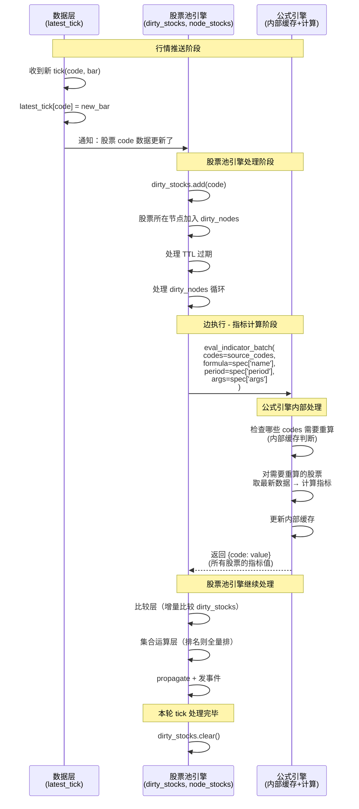

# 股票池深度重构规划 v1.7

> 版本主题：股票级水位线 + 公式引擎契约 + 前后端共享规格
> 设计原则：表驱动、数据驱动、事件驱动、增量优先、全量保底、概念最简
> 目标：从全局 data_dirty 进化到股票级 dirty_stocks，明确公式引擎接口契约，启动前后端共享规格

---

## v1.6.1 → v1.7 变更摘要表

**变更日期：** 2026-07-01

| # | 变更项 | v1.6.1 | v1.7 | 本质变化 |
|---|--------|--------|------|---------|
| 1 | **数据脏标记粒度（核心升级）** | 全局 `data_dirty` / `latest_tick_ts`（一只股票变了，所有股票都要重算） | **股票级 `dirty_stocks: Set[code]`**（哪只股票变了，只重算那只） | 从"全局粗粒度"到"股票级细粒度"——性能数量级提升 |
| 2 | **冗余概念删除** | `data_dirty` + `node_dirty` 独立概念 | **删除 `data_dirty`，节点脏 = 节点里有脏股票** | 概念瘦身——`dirty_stocks` 是唯一的脏数据来源 |
| 3 | **公式引擎接口契约** | 隐式调用，接口不清晰 | **明确接口：`eval_indicator` / `eval_indicator_batch` / `get_cache_stats`** | 职责清晰——股票池引擎只调用接口，不关心公式引擎内部实现 |
| 4 | **前后端共享规格** | 前后端各自维护公式/算子定义 | **JSON Schema 驱动：formula_registry.json / node_types.json / comparison_operators.json 前后端共用** | 单一真相源——避免前后端定义不一致 |
| 5 | **排名/截面类 filter 处理** | 隐含全量重算 | **明确：指标值增量算，排名全量排**（指标值只重算 dirty_stocks，排名基于全量指标值） | 增量与全量的清晰边界 |
| 6 | **核心运行时表数** | 5 张 | **5 张（数量不变，但内容升级）** | `data_dirty` → `dirty_stocks`，粒度更细 |

**一句话总结 v1.7 升级：** 从"全局 data_dirty 粗粒度"进化到"股票级 dirty_stocks 细粒度"，哪只股票数据更新了只重算那只的指标；明确公式引擎接口契约，用时序图说明数据流；启动前后端共享规格，用 JSON Schema 定义公式注册表、节点类型、比较算子，前后端共用同一份定义。概念更少更清晰。

---

## 一、核心升级：股票级水位线 dirty_stocks

### 1.1 为什么全局 data_dirty 不够？

**v1.6.1 的问题：全局 data_dirty 粒度太粗。**

```
场景：股票 A 来了一个 tick，股票 B 没动静

v1.6.1 的做法（全局 data_dirty）：
  data_dirty = True
  → 所有节点标记为脏（或所有股票都要重算指标）
  → 股票 B 的指标也要重算一遍（完全没必要）

问题本质：
  一只股票的数据更新了，不应该导致所有股票的指标都重算
  指标计算是"单股独立"的——股票 A 的数据不影响股票 B 的指标值
```

**正确的粒度：股票级。**

```
正确逻辑：
  股票 A 的 tick 来了 → dirty_stocks.add("A")
  股票 B 没来 tick → 不在 dirty_stocks 里
  
计算指标时：
  对 dirty_stocks 里的股票 → 重算指标（调用公式引擎）
  对不在 dirty_stocks 里的股票 → 读缓存（公式引擎内部缓存）
  → 只有数据变了的股票才重算，其他的直接用缓存
```

### 1.2 股票级水位线的核心洞察

**指标计算是单股独立的纯函数：**

```
指标值(code) = f(该股票的K线数据, 公式, 参数, 周期)

推论：
  股票 A 的数据变了 → 只影响股票 A 的指标值
  股票 B 的数据没变 → 股票 B 的指标值一定没变
  → 只需要重算股票 A 的指标，股票 B 的直接读缓存
```

**这是性能提升的关键：**

- 假设全市场 5000 只股票，一轮 tick 只有 100 只有成交
- 全局 data_dirty：5000 只都要重算指标
- 股票级 dirty_stocks：只重算 100 只，性能提升 50 倍
- 而且 tick 越稀疏（比如早盘尾盘），性能提升越大

### 1.3 但排名/截面类 filter 怎么办？

**重要：排名是相对的，需要全量数据。**

```
排名类 filter（如"涨幅前10名"）：
  - 指标值本身：可以增量算（只重算 dirty_stocks 的指标）
  - 排名结果：必须全量排（因为排名是相对的，一只股票涨了，所有股票的排名都可能变）
  
所以：
  第一层（指标层）：增量算，只重算 dirty_stocks
  第二层（比较层）：增量比，只比较 dirty_stocks
  第三层（集合运算-排名）：全量排，基于所有股票的指标值
```

**增量与全量的清晰边界：**

| filter 层 | 计算策略 | 说明 |
|----------|---------|------|
| 指标层（indicator） | **增量** | 只重算 dirty_stocks 里的股票，其他读缓存 |
| 比较层（compare） | **增量**（独立型） | 只比较 dirty_stocks 里的股票，其他结果不变 |
| 集合运算层（set_op）- 逻辑组合 | **增量** | 只重新组合有变化的比较结果 |
| 集合运算层（set_op）- 排名/截面 | **全量** | 排名是相对的，必须基于全量指标值重排 |

### 1.4 删除冗余的 data_dirty

**有了 dirty_stocks，data_dirty 就完全冗余了。**

```
v1.6.1 的两个脏概念：
  1. data_dirty（全局数据脏标记）
  2. node_dirty / dirty_nodes（节点脏集合）

v1.7 的一个脏概念：
  1. dirty_stocks: Set[code]（本轮数据更新了的股票）
  
节点脏的定义简化为：
  节点 nid 脏 = node_stocks[nid] ∩ dirty_stocks ≠ ∅
  即：该节点里有数据更新了的股票
```

**为什么可以删除 data_dirty？**

- `data_dirty = True` 等价于 `len(dirty_stocks) > 0`
- 全局标记的信息已经完全包含在股票级集合里了
- 而且 dirty_stocks 提供了更精细的信息（具体哪只股票变了）
- 所以 data_dirty 完全冗余，删掉

### 1.5 节点脏的新定义

**节点脏 = 节点里有脏股票，或者节点股票列表本身变了。**

```python
# v1.7 的节点脏判定
def is_node_dirty(nid):
    # 情况1：节点里有数据更新了的股票
    if node_stocks[nid] & dirty_stocks:
        return True
    
    # 情况2：节点股票列表本身变化了（入池/出池/TTL过期）
    if nid in dirty_nodes:
        return True
    
    return False
```

**注意：`dirty_nodes` 这个名字可能也要 reconsider——但暂时保留，因为它还承载"节点股票列表变化"的语义。** 等后续再进一步瘦身。

---

## 二、公式引擎接口契约

### 2.1 为什么需要明确的接口契约？

**股票池引擎和公式引擎是两个独立的模块，应该通过清晰的接口交互。**

```
现状（隐式调用，边界模糊）：
  股票池引擎 → 直接调 formula_engine.eval_batch()
  股票池引擎 → 知道公式引擎内部有 compiled_cache
  股票池引擎 → 甚至可能想自己维护缓存

问题：
  - 职责不清，耦合严重
  - 替换公式引擎（比如从 PythonFormulaEngine 换成 HQChart）很麻烦
  - 优化缓存策略时，两边都要改
```

**v1.7 明确接口契约：**

```
理想状态（清晰边界）：
  股票池引擎 → 只调用公式引擎的公开接口
  股票池引擎 → 不关心公式引擎内部怎么实现、怎么缓存
  公式引擎 → 内部自己维护缓存、做增量计算
  公式引擎 → 可以任意替换实现，只要接口不变
```

### 2.2 公式引擎公开接口定义

**核心接口（3个）：**

| 接口 | 签名 | 说明 |
|------|------|------|
| `eval_indicator` | `eval_indicator(code: str, formula: str, period: str, args: dict = None) -> float \| bool \| None` | 单只股票单指标求值 |
| `eval_indicator_batch` | `eval_indicator_batch(codes: List[str], formula: str, period: str, args: dict = None) -> Dict[str, float \| bool \| None]` | 批量股票单指标求值 |
| `get_cache_stats` | `get_cache_stats() -> dict` | 获取缓存统计（命中率、缓存大小等） |

**批量多指标接口（优化用，可选）：**

| 接口 | 签名 | 说明 |
|------|------|------|
| `eval_multi_indicator_batch` | `eval_multi_indicator_batch(codes: List[str], formulas: List[dict], period: str = None) -> Dict[str, Dict[str, Any]]` | 批量股票多指标批量求值，formulas 里每项含 formula_id + formula + args + period |

**接口契约说明：**

1. **股票池引擎只调用这些接口**，不访问公式引擎的内部状态
2. **公式引擎内部自己维护缓存**，包括编译缓存、计算结果缓存等
3. **公式引擎自己做增量优化**，股票池引擎不需要知道
4. **接口返回值语义清晰**：
   - 指标类返回 float（或 None 表示数据不足）
   - 条件类返回 bool（True/False）
   - 多输出指标返回 dict（`{output_name: value}`）

### 2.3 公式引擎内部实现（股票池引擎不需要知道）

**股票池引擎不需要知道公式引擎内部怎么实现，只需要知道接口。**

但为了完整性，这里列出公式引擎内部可以做的优化（仅供参考）：

```
公式引擎内部可以有的优化（股票池引擎不关心）：
  1. 公式编译缓存（formula → compiled_code）
     - LRU 缓存，避免重复编译
     
  2. K线数据缓存（code + period → DataFrame）
     - 历史K线（已完成的）不变，可以缓存
     - 最新一根K线（未完成的）每个tick更新
     
  3. 指标值缓存（code + formula + period + args → value）
     - 历史K线的指标值不变，可以缓存
     - 最新一根K线的指标值，数据变了就重算
     
  4. 增量计算
     - 只更新最新一根K线的指标值
     - 历史值直接用缓存
```

**关键：这些都是公式引擎内部的事，股票池引擎完全不需要知道。** 股票池引擎只需要调用 `eval_indicator_batch()`，拿到结果就行。

### 2.4 时序图：数据更新 → 指标计算的完整流程

**用 Mermaid 时序图说明数据流：**



**时序图关键解读：**

1. **数据层**：只负责维护 `latest_tick`，通知股票池引擎哪只股票更新了
2. **股票池引擎**：维护 `dirty_stocks`，知道哪只股票变了，调用公式引擎批量求值
3. **公式引擎**：内部自己管缓存，返回所有请求股票的指标值（脏的重算，不脏的读缓存）
4. **股票池引擎不关心**公式引擎内部哪些是重算的、哪些是读缓存的——它只拿到结果

### 2.5 为什么公式引擎接口是批量的？

**为什么是 `eval_indicator_batch(codes, formula, ...)` 而不是循环调用 `eval_indicator(code, formula, ...)`？**

```
批量接口的优势：
  1. 公式引擎可以做批量优化（比如向量化计算）
  2. 减少函数调用开销
  3. 公式引擎可以统一管理缓存（批量检查缓存有效性）
  4. 未来替换为高性能引擎（如 HQChart）时，批量接口更高效

股票池引擎的用法：
  - 一条边的 filter 用到某个指标
  - 源节点有 N 只股票
  - 一次性调用 eval_indicator_batch(codes=N只股票, ...)
  - 拿到所有股票的指标值
```

---

## 三、前后端共享规格（JSON Schema）

### 3.1 为什么需要前后端共享规格？

**现状问题：前后端各自维护定义，容易不一致。**

```
现状：
  前端：硬编码公式列表、比较算子列表、节点类型定义
  后端：config 目录下的 JSON 配置
  
问题：
  1. 定义不一致：前端加了一个算子，后端没加 → 报错
  2. 重复劳动：同样的定义要写两遍
  3. 维护困难：改一个东西，两边都要改
  4. 容易出错：前端类型检查弱，定义错了发现晚
```

**v1.7 启动前后端共享规格：**

```
目标：
  1. 单一真相源：同一份 JSON 定义，前后端都用
  2. JSON Schema：用 schema 约束格式，自动校验
  3. 前端动态加载：前端从后端 API 获取配置，不硬编码
  4. 后端校验：后端用 schema 校验配置文件，启动时就发现问题
```

### 3.2 共享规格文件清单

**第一阶段共享的三个核心规格：**

| 规格文件 | 用途 | 前后端怎么用 |
|----------|------|-------------|
| `formula_registry.json` | 公式注册表（所有可用指标/公式） | 前端：公式选择器下拉列表<br/>后端：公式解析、计算、编译期去重 |
| `node_types.json` | 节点类型定义（备选池/条件池/目标池等） | 前端：节点拖拽面板、节点属性配置<br/>后端：节点类型校验、行为分派 |
| `comparison_operators.json` | 比较算子定义（大于/小于/金叉/死叉等） | 前端：比较算子选择器、参数配置<br/>后端：比较逻辑执行、表驱动分派 |

**后续可以扩展的共享规格：**

- `propagation_modes.json`：传播模式定义
- `timing_triggers.json`：时间触发条件定义
- `pool_template.json`：股票池模板

### 3.3 formula_registry.json 规格设计

**JSON Schema 定义（示意）：**

```json
{
  "$schema": "http://json-schema.org/draft-07/schema#",
  "title": "FormulaRegistry",
  "type": "object",
  "properties": {
    "version": { "type": "string", "description": "规格版本" },
    "formulas": {
      "type": "array",
      "items": {
        "type": "object",
        "properties": {
          "id": { "type": "string", "description": "公式唯一ID" },
          "name": { "type": "string", "description": "公式名称（显示用）" },
          "category": { 
            "type": "string", 
            "enum": ["indicator", "xg", "exp"],
            "description": "公式类别：指标/选股/专家系统"
          },
          "description": { "type": "string", "description": "公式描述" },
          "script": { "type": "string", "description": "公式脚本代码" },
          "args": {
            "type": "array",
            "items": {
              "type": "object",
              "properties": {
                "name": { "type": "string" },
                "label": { "type": "string" },
                "type": { "type": "string", "enum": ["int", "float"] },
                "default": { "type": "number" },
                "min": { "type": "number" },
                "max": { "type": "number" },
                "step": { "type": "number" }
              },
              "required": ["name", "label", "type", "default"]
            }
          },
          "outputs": {
            "type": "array",
            "items": {
              "type": "object",
              "properties": {
                "name": { "type": "string" },
                "label": { "type": "string" },
                "is_default": { "type": "boolean" }
              }
            }
          },
          "is_builtin": { "type": "boolean" }
        },
        "required": ["id", "name", "category", "script"]
      }
    }
  }
}
```

**前后端使用方式：**

- **后端**：启动时加载并校验 `formula_registry.json`，编译期去重
- **前端**：通过 `/api/formula/registry` 接口获取，动态渲染公式选择器

### 3.4 node_types.json 规格设计

**JSON Schema 定义（示意）：**

```json
{
  "$schema": "http://json-schema.org/draft-07/schema#",
  "title": "NodeTypes",
  "type": "object",
  "properties": {
    "version": { "type": "string" },
    "node_types": {
      "type": "array",
      "items": {
        "type": "object",
        "properties": {
          "type": { "type": "string", "description": "节点类型标识" },
          "label": { "type": "string", "description": "显示名称" },
          "category": { 
            "type": "string", 
            "enum": ["source", "condition", "target", "set_op"],
            "description": "节点类别"
          },
          "icon": { "type": "string", "description": "图标标识" },
          "color": { "type": "string", "description": "主题色" },
          "description": { "type": "string" },
          "allow_input": { "type": "boolean", "description": "是否允许入边" },
          "allow_output": { "type": "boolean", "description": "是否允许出边" },
          "max_inputs": { "type": "integer", "description": "最大入边数，-1表示无限" },
          "max_outputs": { "type": "integer", "description": "最大出边数，-1表示无限" },
          "default_config": { "type": "object", "description": "默认配置" },
          "config_schema": { 
            "type": "object", 
            "description": "配置项Schema，用于前端动态渲染配置面板" 
          }
        },
        "required": ["type", "label", "category"]
      }
    }
  }
}
```

**前后端使用方式：**

- **后端**：加载节点类型，校验节点配置合法性
- **前端**：通过 `/api/node/types` 获取，动态渲染节点面板、属性配置

### 3.5 comparison_operators.json 规格设计

**JSON Schema 定义（示意）：**

```json
{
  "$schema": "http://json-schema.org/draft-07/schema#",
  "title": "ComparisonOperators",
  "type": "object",
  "properties": {
    "version": { "type": "string" },
    "operators": {
      "type": "array",
      "items": {
        "type": "object",
        "properties": {
          "id": { "type": "string", "description": "算子唯一ID" },
          "label": { "type": "string", "description": "显示名称" },
          "symbol": { "type": "string", "description": "符号表示（如 >, <, =）" },
          "mode": { 
            "type": "string", 
            "enum": ["compare", "rank", "cross", "inflection"],
            "description": "算子模式：比较/排名/穿越/拐点"
          },
          "description": { "type": "string" },
          "needs_value": { "type": "boolean", "description": "是否需要比较值（fsecond）" },
          "needs_vector": { "type": "boolean", "description": "是否需要向量数据（如拐点需要历史值）" },
          "params": {
            "type": "array",
            "items": {
              "type": "object",
              "properties": {
                "name": { "type": "string" },
                "label": { "type": "string" },
                "type": { "type": "string", "enum": ["int", "float", "bool"] },
                "default": { "type": ["number", "boolean"] }
              }
            }
          },
          "rank_config": {
            "type": "object",
            "properties": {
              "order": { "type": "string", "enum": ["desc", "asc"] },
              "tie_handling": { "type": "string", "enum": ["none", "exact_rank"] }
            }
          }
        },
        "required": ["id", "label", "mode"]
      }
    }
  }
}
```

**前后端使用方式：**

- **后端**：加载比较算子，表驱动分派比较逻辑
- **前端**：通过 `/api/comparison/operators` 获取，动态渲染算子选择器和参数配置

### 3.6 共享规格的落地路径

**分三阶段落地：**

| 阶段 | 做什么 | 产出 |
|------|--------|------|
| **阶段一：后端先行** | 把现有 config 目录下的 JSON 文件整理为标准规格，加 JSON Schema | 规格文件 + Schema 文件，后端用 Schema 校验 |
| **阶段二：前端接入** | 前端从后端 API 动态加载规格，替换硬编码 | 前端公式选择器、节点面板、算子选择器都动态渲染 |
| **阶段三：双向校验** | 前后端都用 Schema 校验，CI/CD 自动检查 | 定义不一致在 CI 阶段就发现 |

**当前 v1.7 先完成阶段一的设计，具体实现后续推进。**

---

## 四、运行时内存表（v1.7 更新版）

### 4.1 核心运行时表（5张，数量不变但内容升级）

| 表名 | 类型 | 读时机 | 写时机 | 说明 |
|------|------|--------|--------|------|
| `latest_tick` | Dict[code → bar_dict] | 公式引擎计算时读 | 行情推送时写 | **唯一真相源**。所有股票的最新tick数据。 |
| `node_stocks` | Dict[nid → List[code]] | propagate 读写、filter 读 | 边执行/TTL过期后写 | 各节点当前股票列表 |
| `dirty_nodes` | Set[nid] | 执行循环读 | 节点股票变化时加入 / 数据更新时加入 | **脏节点集合**。节点脏了=该节点有脏股票或股票列表变化 |
| `ttl_expiry_queue` | Heap[(expire_ts, nid, code)] | tick 开始时弹出 | 股票入池时插入 | TTL 过期队列。按过期时间排序的最小堆 |
| `dirty_stocks` | Set[code] | 指标计算时读（只重算脏股票） | tick数据更新时加入 / 本轮处理完清空 | **股票级水位线**。本轮数据更新了的股票集合，替代全局 data_dirty |

**v1.7 相比 v1.6.1 的变化：**

| v1.6.1（5张） | v1.7（5张） | 变化原因 |
|-------------|-------------|---------|
| `latest_tick` | `latest_tick` | 不变 |
| `node_stocks` | `node_stocks` | 不变 |
| `dirty_nodes` | `dirty_nodes` | 不变（语义微调：节点脏 = 有脏股票 或 股票列表变化） |
| `ttl_expiry_queue` | `ttl_expiry_queue` | 不变 |
| `data_dirty` / `latest_tick_ts` | `dirty_stocks` | **替换**：全局粗粒度 → 股票级细粒度，性能数量级提升 |

**净变化：5张 → 5张，数量不变，但质量大幅提升（细粒度水位线）。**

### 4.2 编译期表（不变）

编译期产物和 v1.6.1 一样，没有变化：

| 编译产物 | 类型 | 说明 |
|----------|------|------|
| `formula_registry` | Dict[indicator_id → formula_spec] | 公式注册表。所有去重后的指标，编译期一次性收集 |
| `comparison_operators` | Dict[op_id → operator_spec] | 比较算子集。所有可用的比较算子，独立于指标 |
| `edge_indicator_refs` | Dict[eid → List[indicator_id]] | 每条边引用的指标ID列表 |
| `edge_compare_spec` | Dict[eid → compare_spec] | 比较层规格（用哪个算子、参数是什么） |
| `edge_set_op_spec` | Dict[eid → set_op_spec] | 集合运算层规格（AND/OR/NOT/排名逻辑） |
| `edge_filter_type` | Dict[eid → 'independent' / 'global'] | filter 类型：单股独立型 / 全局依赖型 |

---

## 五、核心循环伪代码（v1.7 更新版）

### 5.1 完整的事件驱动循环

```
1. 等数据更新（或时间步进）
2. 新数据来了吗？
   → 没来：去步骤 3
   → 来了：
       for code, new_bar in 新tick数据:
           latest_tick[code] = new_bar
           dirty_stocks.add(code)          # v1.7：股票级水位线
           # 股票所在节点标记为脏
           for nid in code_nodes[code]:
               dirty_nodes.add(nid)
3. 处理 TTL 过期：
   从 ttl_expiry_queue 弹出所有 expire_ts <= now 的股票
   → 从对应节点 node_stocks[nid] 移除
   → 节点 nid 加入 dirty_nodes
4. 处理 dirty_nodes（按边的执行顺序）：
   while dirty_nodes 不为空：
      取出一个节点 nid
      
      遍历 nid 的所有条件出边，按 edge_order 排序：
         eid = 当前边
         sid, tid = edge_endpoints[eid]
         
         a. 检查三要素：
            ① 时间触发条件满足吗？
               → 不满足：跳过
            ② 源节点需要重新计算吗？
               (node_stocks[sid] & dirty_stocks) or (sid in dirty_nodes)
               即：源节点有脏股票 OR 源节点股票列表变了
               → 都没有：跳过
         
         b. === 第一层：指标计算（调用公式引擎，增量） ===
            indicator_ids = edge_indicator_refs[eid]
            source_codes = node_stocks[sid]
            
            对每个 ind_id in indicator_ids:
                spec = formula_registry[ind_id]
                # 调用公式引擎批量接口，公式引擎自己管缓存
                # v1.7：传所有 source_codes，公式引擎内部决定哪些重算
                values = formula_engine.eval_indicator_batch(
                    codes=source_codes,          # 源节点所有股票
                    formula=spec['name'],
                    period=spec['period'],
                    args=spec['args'],
                )
                # values 是 {code: value}，所有股票的指标值
                # 公式引擎内部：dirty_stocks 的重算，其他读缓存
            
            # 所有指标值都准备好了
         
         c. === 第二层：比较判断（独立型增量） ===
            compare_spec = edge_compare_spec[eid]
            operator = comparison_operators[compare_spec["operator_id"]]
            
            如果是独立比较型：
               → 增量比较：只重算 dirty_stocks ∩ source_codes 的股票
               → 其他股票的比较结果不变，沿用上次
               → 汇总得到 per_stock_result[code] = bool
         
         d. === 第三层：集合运算（AND/OR/NOT/排名） ===
            set_op_spec = edge_set_op_spec[eid]
            
            如果是排名型（全局依赖型）：
               → 指标值已经有了（第一层的结果）
               → 全量排名（基于所有 source_codes 的指标值）
               → passed_codes = 排名结果
            
            如果是逻辑组合型（独立型）：
               → 组合多个比较结果
               → passed_codes = 组合结果
         
         e. === propagate（边的步骤，不是filter层） ===
            propagate_spec = edge_propagate_spec[eid]
            → 应用传播模式到 node_stocks[tid]
            → 对比得到 entered_codes 和 exited_codes
         
         f. 如果有变化：
              - tid 加入 dirty_nodes
              - 处理无条件边：立即同步 propagate
              - 立即发射入池/出池事件
      
      # 处理完这个节点的所有边后，从 dirty_nodes 移除
      dirty_nodes.discard(nid)
5. 清 dirty_stocks（本轮tick处理完了）  # v1.7：不是 data_dirty，是 dirty_stocks
6. 回去等下一次数据更新
```

### 5.2 核心循环的关键变化（v1.6.1 → v1.7）

| 步骤 | v1.6.1 | v1.7 | 变化 |
|------|--------|------|------|
| 数据更新 | `data_dirty = True` | `dirty_stocks.add(code)` | 全局标记 → 股票级集合 |
| 边触发检查 | 检查 `data_dirty` | 检查 `node_stocks[sid] & dirty_stocks` | 全局判断 → 节点内是否有脏股票 |
| 指标计算 | 全量重算（隐含） | 公式引擎内部增量（dirty_stocks 重算，其他读缓存） | 粗粒度 → 细粒度增量 |
| 比较层（独立型） | 隐含全量比较 | 只比较 dirty_stocks ∩ source_codes | 性能提升 |
| 本轮结束清理 | `data_dirty = False` | `dirty_stocks.clear()` | 对应变化 |

---

## 六、功能-表操作对应表（v1.7 更新版）

### 6.1 数据层（股票级水位线）

| 功能 | 读什么表 | 写什么表 | 计算 |
|------|---------|---------|------|
| 行情推送 | — | `latest_tick[code] = new_bar` + `dirty_stocks.add(code)` | **v1.7 核心升级**：股票级水位线，哪只变了加哪只 |
| **数据更新触发节点脏** | `code_nodes[code]` | `dirty_nodes.add(nid)` | 不变，股票有新数据 → 所在节点标记为脏 |
| **指标计算** | 公式引擎接口 `eval_indicator_batch` | — | **v1.7 核心**：传所有 codes，公式引擎内部增量（dirty_stocks 重算，其他读缓存） |
| **编译期指标去重** | 所有边的指标配置 | `formula_registry` + `edge_indicator_refs` | 不变，相同（公式+参数+周期）合并为一个 |

**关键变化（v1.6.1 → v1.7）：**
- 全局 `data_dirty` → 股票级 `dirty_stocks: Set[code]`
- 指标计算从"全量重算" → "公式引擎内部增量计算"
- 性能数量级提升（只有数据变了的股票才重算指标）

### 6.2 TTL 淘汰层（事件驱动，非轮询）

| 功能 | 读什么表 | 写什么表 | 计算 |
|------|---------|---------|------|
| 股票入池记录 TTL | `edge_ttl_spec[eid]` | `ttl_expiry_queue` 插入 `(expire_ts, nid, code)` | `expire_ts = now + ttl_sec` |
| TTL 过期检查 | `ttl_expiry_queue + now` | 弹出过期项 | 最小堆：堆顶过期就弹出，直到堆顶未过期 |
| 过期股票移除 | `node_stocks[nid]` | `node_stocks[nid]` | 从节点移除过期股票 |
| 过期触发级联 | — | `dirty_nodes.add(nid)` + 无条件边立即执行 | 节点脏驱动，源节点变了 → 节点脏 → 出边都要检查 |

**（这部分完全不变）**

### 6.3 边触发判定层（节点脏驱动 + 三要素 AND）

| 功能 | 读什么表 | 写什么表 | 计算 |
|------|---------|---------|------|
| **数据更新 → 节点脏** | `code_nodes[code]` | `dirty_nodes.add(nid)` | 股票有新数据 → 所在节点标记为脏 |
| 节点股票状态变化 → 节点脏 | `out_edges[sid]` | `dirty_nodes.add(nid)` | 源节点变了 → 节点脏 → 出边都要检查 |
| 边时间触发检查 | `edge_timing_spec[eid] + _flow_state[eid]` | — | `starttype × cxtype` 的判定 |
| **三要素检查** | `dirty_stocks` + 节点脏 + 时间条件 | — | **v1.7 更新**：时间条件 AND (节点有脏股票 OR 节点股票列表变化) |
| 边是否需要执行 | 三要素是否全部满足 | — | 三要素都满足就执行，否则跳过 |

**关键变化（v1.6.1 → v1.7）：**
- 三要素检查中的"数据变化"从 `data_dirty` 变成 `node_stocks[sid] & dirty_stocks`
- 更精确：只有当源节点里真的有脏股票时，才需要重新计算

### 6.4 边执行层（三层filter + 混合策略 + propagate + 即时事件）

| 功能 | 读什么表 | 写什么表 | 计算 |
|------|---------|---------|------|
| **filter 类型判断** | `edge_filter_type[eid]` | — | 先判断 independent / global，再选策略 |
| **第一层：指标计算（调用公式引擎）** | `formula_registry` + 公式引擎接口 `eval_indicator_batch` | — | **v1.7 核心变化**：传所有 codes，公式引擎内部增量（dirty_stocks 重算，其他读缓存），股票池引擎不关心缓存细节 |
| **第二层：比较判断（独立型增量）** | 指标值（来自公式引擎） + `comparison_operators` + `edge_compare_spec[eid]` + `dirty_stocks` | edge_filter_cache（可选优化） | **v1.7 增强**：只比较 dirty_stocks ∩ source_codes，其他沿用上次结果 |
| **第三层：集合运算（AND/OR/NOT/排名）** | 指标值 + `edge_set_op_spec[eid]` + `node_stocks[sid]` | — | 不变：排名型全量排，逻辑型增量组合 |
| **propagate（边的步骤）** | `node_stocks[sid]` + `node_stocks[tid]` + `edge_propagate_spec[eid]` | `node_stocks[tid]` | 不变，传播是边的步骤，不是filter层 |
| **即时事件发射** | `node_stocks[tid]` 新旧对比 + `node_role[tid]` | `event_queue` + `signal_queue` | 差集计算，每条边执行后立即发射 |
| 无条件边立即传播 | `node_stocks[sid]` + `edge_propagate_spec[eid]` | `node_stocks[tid]` | 直接 propagate，无 gate，无 filter |

**关键变化（v1.6.1 → v1.7）：**
- 指标计算：明确通过公式引擎接口调用，公式引擎内部增量
- 比较层（独立型）：明确只比较 dirty_stocks 里的股票，性能提升

### 6.5 事件层（流式逐条产生）

| 功能 | 读什么表 | 写什么表 | 计算 | 时机 |
|------|---------|---------|------|------|
| 入池事件 | `node_stocks[tid]` 执行前后对比 | `event_queue` | 差集计算（新 - 旧） | 每条边执行后立即发射 |
| 出池事件 | `node_stocks[sid]` 执行前后对比 | `event_queue` | 差集计算（旧 - 新） | 每条边执行后立即发射 |
| 预警事件 | `alert_rules + node_stocks` 变化 | `alert_queue` | 规则匹配 | 每条边执行后立即检查 |
| 交易信号 | `node_role[tid] == 'target' + 入池/出池` | `signal_queue` | 角色判定 + 信号生成 | 每条边执行后立即生成 |

**（这部分完全不变）**

### 6.6 后处理层（PK排名/分析角度/看盘面板）

| 功能 | 读什么表 | 写什么表 | 计算 |
|------|---------|---------|------|
| PK排名 | `node_stocks[target] + latest_tick + pk_config` | `_pk_rankings` | 按权重评分排序，指标值通过公式引擎接口获取 |
| 分析角度 | `node_stocks[target] + latest_tick + analysis_config` | `_angle_results` | 多维度计算，指标值通过公式引擎接口获取 |
| 看盘面板 | `node_stocks + latest_tick + dashboard_schema` | `_dashboard_data` | 组装显示数据，指标值通过公式引擎接口获取 |

**注意：后处理也通过公式引擎接口获取指标值！**
- PK 排名用到的指标，直接调用公式引擎 `eval_indicator_batch`
- 公式引擎内部会做缓存，不用重复计算
- 股票池引擎不需要关心缓存细节

---

## 七、概念瘦身对照表（v1.6.1 → v1.7）

### 7.1 消除的概念/表

| v1.6.1 概念 | v1.7 处理 | 理由 |
|-----------|-----------|------|
| `data_dirty` / `latest_tick_ts` | **删除**，用 `dirty_stocks` 替代 | 冗余。全局标记的信息完全包含在股票级集合里，而且 dirty_stocks 更精细。 |
| `node_dirty` 作为独立概念 | **弱化**，节点脏 = 节点里有脏股票 OR 节点股票列表变化 | 概念瘦身。节点脏不是一个独立的"东西"，而是两种情况的结果。 |

### 7.2 新增的概念

| v1.7 新概念 | 说明 | 为什么加 |
|-----------|------|-----------|
| `dirty_stocks: Set[code]` | 股票级水位线，本轮数据更新了的股票集合 | 性能核心。细粒度增量计算，哪只股票变了只重算那只。 |
| 公式引擎接口契约 | `eval_indicator` / `eval_indicator_batch` / `get_cache_stats` | 职责清晰。股票池引擎只调用接口，不关心公式引擎内部实现。 |
| 前后端共享规格 | formula_registry.json / node_types.json / comparison_operators.json + JSON Schema | 单一真相源。避免前后端定义不一致，减少重复劳动。 |

### 7.3 概念数量统计

| 版本 | 核心运行时表数 | 变化 |
|------|---------------|------|
| v1.5 | 8 张 | — |
| v1.6 | 7 张 | -1 |
| v1.6.1 | 5 张 | -2 |
| v1.7 | **5 张** | **0（数量不变，质量升级）** |

v1.7 核心运行时表（5张）：
1. `latest_tick`（唯一真相源）
2. `node_stocks`（节点股票）
3. `dirty_nodes`（脏节点）
4. `ttl_expiry_queue`（TTL队列）
5. `dirty_stocks`（股票级水位线）← 替代了 data_dirty

**对，还是 5 张，但第 5 张从"全局粗粒度"升级为"股票级细粒度"，性能数量级提升。**

### 7.4 保留的正确设计（v1.6.1 做对的部分，v1.7 继续保留）

| 设计 | 说明 | 状态 |
|------|------|------|
| 指标是纯函数，数据不变则结果不变 | ✅ | 保留，这是最根本的洞察 |
| filter三层结构（指标→比较→集合运算） | ✅ | 保留，概念清晰 |
| 传播是边的步骤，不是filter层 | ✅ | 保留，职责分离 |
| 公式注册表 + 编译期指标去重 | ✅ | 保留，避免重复计算 |
| 比较算子正交化（指标×算子=filter） | ✅ | 保留，笛卡尔积设计 |
| 节点脏驱动 | ✅ | 保留，事件驱动 |
| 无条件边立即传播 | ✅ | 保留，同步传播 |
| 公式引擎内部维护指标缓存 | ✅ | 保留，职责分离 |
| 单一水位线思路 | ✅ | **升级**：从全局粗粒度 → 股票级细粒度 |

---

## 八、实现路线图（v1.7）

### 阶段一：股票级水位线 dirty_stocks（P0）

1. **用 `dirty_stocks: Set[code]` 替代 `data_dirty`**
   - 数据更新时：`dirty_stocks.add(code)` 而不是 `data_dirty = True`
   - 边触发检查时：检查 `node_stocks[sid] & dirty_stocks` 而不是 `data_dirty`
   - 本轮处理完：`dirty_stocks.clear()` 而不是 `data_dirty = False`

2. **指标计算增量优化（公式引擎层面）**
   - 公式引擎接收 `dirty_stocks` 信息（或自己判断哪些数据变了）
   - 只重算 dirty_stocks 里的股票指标，其他读缓存
   - 股票池引擎不关心这个优化，只调用接口

3. **比较层增量优化（独立型）**
   - 独立比较型 filter：只比较 dirty_stocks ∩ source_codes
   - 其他股票的比较结果沿用上次

### 阶段二：公式引擎接口契约（P0）

1. **明确公式引擎公开接口**
   - `eval_indicator(code, formula, period, args) -> value`
   - `eval_indicator_batch(codes, formula, period, args) -> {code: value}`
   - `get_cache_stats() -> dict`

2. **股票池引擎只通过公开接口调用公式引擎**
   - 禁止直接访问公式引擎内部状态
   - 禁止股票池引擎自己维护指标缓存

3. **补充时序图和接口文档**
   - 明确数据流向
   - 明确各层职责边界

### 阶段三：前后端共享规格启动（P0 启动，P1 落地）

1. **整理现有配置文件为标准规格**
   - `formula_registry.json` 标准化
   - `node_types.json` 新建（从代码中提取节点类型定义）
   - `comparison_operators.json` 标准化

2. **编写 JSON Schema**
   - 每个规格文件对应一个 Schema
   - 后端启动时用 Schema 校验配置

3. **提供后端 API**
   - `/api/formula/registry` - 获取公式注册表
   - `/api/node/types` - 获取节点类型定义
   - `/api/comparison/operators` - 获取比较算子定义

4. **前端后续接入（不在 v1.7 范围内，后续推进）**
   - 前端从 API 动态加载配置
   - 替换硬编码的公式列表、算子列表等

### 阶段四：验证与文档

1. **性能验证**：确认 dirty_stocks 增量计算的性能提升
2. **正确性验证**：确保增量计算结果和全量计算一致
3. **文档更新**：所有文档统一使用 v1.7 的概念

---

## 九、统计总结（v1.6.1 → v1.7）

### 9.1 概念数量变化

| 统计项 | v1.6.1 | v1.7 | 变化 |
|--------|--------|------|------|
| 核心运行时表 | 5 张 | **5 张** | 0（数量不变，质量升级） |
| filter 层数 | 3 层 | 3 层 | 不变 |
| 核心概念（估算） | ~8 个 | ~8 个 | 0（删了 data_dirty，加了 dirty_stocks，净变化 0） |
| 公式引擎接口 | 隐式 | **明确契约** | 新增接口定义 |
| 前后端共享规格 | 无 | **启动设计** | 新增 JSON Schema 驱动的共享规格 |

### 9.2 性能提升估算

| 场景 | v1.6.1（全局 data_dirty） | v1.7（股票级 dirty_stocks） | 性能提升 |
|------|--------------------------|----------------------------|---------|
| 全市场 5000 只，100 只有 tick | 5000 只都重算指标 | 100 只重算，4900 只读缓存 | ~50 倍 |
| 全市场 5000 只，500 只有 tick | 5000 只都重算指标 | 500 只重算，4500 只读缓存 | ~10 倍 |
| 全市场 5000 只，5000 只有 tick | 5000 只都重算指标 | 5000 只重算（都脏） | 相同（最坏情况） |

**结论：tick 越稀疏，性能提升越大。最坏情况（所有股票都有 tick）和 v1.6.1 持平。**

### 9.3 一句话总结

**v1.7 从"全局 data_dirty 粗粒度"进化到"股票级 dirty_stocks 细粒度"，哪只股票数据更新了只重算那只的指标，性能数量级提升；明确公式引擎接口契约，用时序图说明数据流；启动前后端共享规格，用 JSON Schema 定义公式注册表、节点类型、比较算子，前后端共用同一份定义。概念数量不变，但质量大幅提升。**

---

## 附录：为什么 dirty_stocks 比 data_dirty 好？

### A.1 粒度对比

| 维度 | data_dirty（全局） | dirty_stocks（股票级） |
|------|------------------|---------------------|
| 表达能力 | "有数据变了" | "具体哪些股票的数据变了" |
| 粒度 | 粗（全局一个标记） | 细（每只股票独立） |
| 信息含量 | 1 bit（是/否） | N bits（N只股票各自的状态） |
| 计算策略 | 全量重算（因为不知道哪只变了） | 增量计算（只重算变了的） |

### A.2 为什么之前没想到？

**因为 v1.6 → v1.6.1 刚从"周期级版本号"简化为"全局水位线"，** 当时的重点是"砍掉过度设计，回归简单"。

**v1.7 是在 v1.6.1 的简单基础上，进一步精细化。** 先做对，再做好。

```
演进路径：
  v1.6：周期级版本号（过度设计，复杂但错了）
  v1.6.1：全局水位线（纠正错误，回归简单，先做对）
  v1.7：股票级水位线（在正确的基础上，精细化，做好）
```

### A.3 为什么不在公式引擎里做，要在股票池引擎里也有？

**两个层面都有，职责不同：**

| 层面 | dirty_stocks 的用途 | 为什么需要 |
|------|-------------------|-----------|
| 股票池引擎 | 知道哪些节点需要重新计算、比较层增量比较 | 节点脏判定、比较层优化需要知道哪只股票变了 |
| 公式引擎 | 知道哪些股票的指标需要重算 | 增量计算指标值 |

**两者信息是一致的，但用途不同。** 股票池引擎把 dirty_stocks 传给公式引擎（或者公式引擎自己也能判断），两边各自做自己的增量优化。

### A.4 排名类 filter 真的需要全量吗？

**是的，排名是相对的。**

```
反例：想做增量排名，为什么不行？

假设：
  股票 A 原来第 5 名，现在涨了
  其他股票数据没变，指标值也没变

问题：
  股票 A 从第 5 名升到第 3 名
  → 原来第 3 名的股票变成第 4 名
  → 原来第 4 名的股票变成第 5 名
  → 这些股票的数据都没变，但排名变了

结论：
  排名是相对的，一只股票变了，所有股票的排名都可能变
  → 排名必须全量排，不能增量
```

**但注意：指标值本身还是可以增量算的。** 排名全量排，但指标值只重算 dirty_stocks 的，其他读缓存。这是两层不同的优化。
